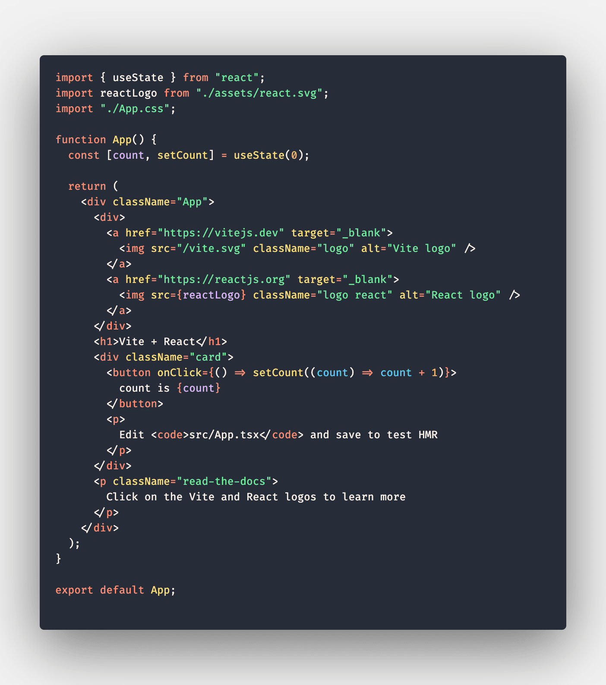

# Sylvan Color Theme

A color theme for those who are tired of dull colors.

Font used in the screenshot is [Fira Code](https://github.com/tonsky/FiraCode).

## Install

1. Go To [VS Marketplace](https://marketplace.visualstudio.com/items?itemName=aa-zeus.sylvan-color-theme).
2. Click on the "Install" button.
3. Then [activate the theme](https://code.visualstudio.com/docs/getstarted/themes#_selecting-the-color-theme).

## Credits

This theme is inspired by [Dracula Official](https://marketplace.visualstudio.com/items?itemName=dracula-theme.theme-dracula).
